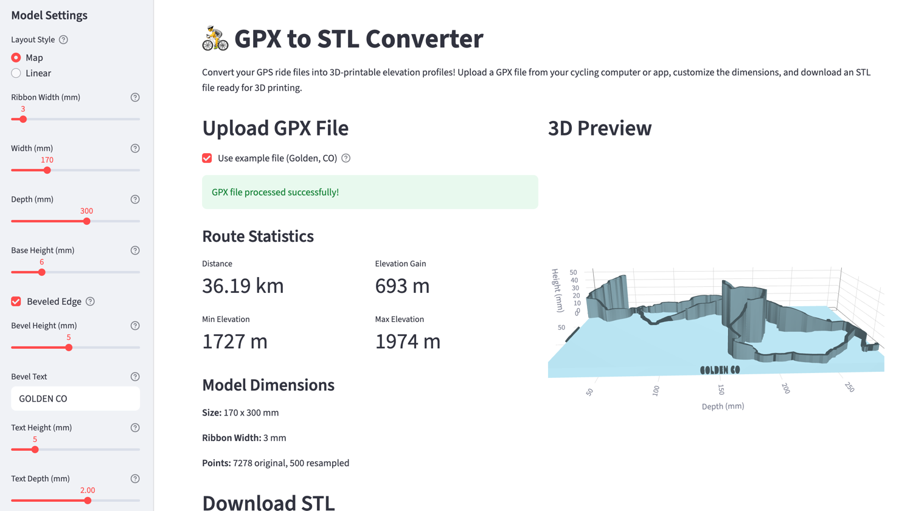

# GPX to STL Converter

Convert GPS track files (GPX) into 3D-printable elevation profile models (STL).



## Features

- **Two Layout Modes:**
  - **Map Layout** - Creates a 3D model that follows the actual GPS track shape, perfect for winding roads, switchbacks, and loops
  - **Linear Layout** - Creates a straight elevation profile like a traditional graph

- **Customizable Base Plate:**
  - Adjustable width and depth
  - Optional beveled edges with 45-degree angle
  - Embossed text on all 4 bevel sides

- **Model Settings:**
  - Ribbon top and base width for track thickness (set base wider than top for tapered look)
  - Base height
  - Vertical exaggeration to emphasize elevation changes
  - Resolution and smoothing controls

- **Interactive 3D Preview** - Rotate, zoom, and pan to inspect your model before downloading

- **STL Export** - Download ready-to-print STL files

## Quick Start

### Using uv (recommended)

```bash
# Install dependencies
uv sync

# Run the Streamlit app
uv run streamlit run app.py
```

### Using pip

```bash
# Install dependencies
pip install -e .

# Run the Streamlit app
streamlit run app.py
```

### Using Docker

```bash
docker build -t gpx-to-stl .
docker run -p 8501:8501 gpx-to-stl
```

Then open http://localhost:8501 in your browser.

## Usage

1. **Upload a GPX file** or use the included example (Golden, CO)
2. **Choose a layout** - Map (follows GPS track) or Linear (straight profile)
3. **Adjust settings** in the sidebar:
   - Width and depth of the model
   - Base height and bevel options
   - Text to emboss on the bevel
   - Vertical exaggeration
4. **Preview** the 3D model in the interactive viewer
5. **Download** the STL file for 3D printing

## Example

The included example file (`examples/golden_colorado.gpx`) shows a route in Golden, Colorado with the following recommended settings:

- Width: 170mm
- Depth: 300mm
- Base Height: 6mm
- Bevel: 5mm with "GOLDEN CO" text
- Vertical Exaggeration: 3x

## Command Line Usage

You can also use the converter from the command line:

```bash
uv run python gps_stl.py ride.gpx -o output.stl --width 200 --layout map
```

Options:
- `--width` - Model width in mm (default: 150)
- `--depth` - Model depth in mm (default: 20)
- `--base` - Base height in mm (default: 5)
- `--exaggeration` - Vertical exaggeration factor (default: 2.0)
- `--points` - Number of points to resample to (default: 500)
- `--smooth` - Smoothing window size (default: 5)
- `--layout` - Layout style: "straight" or "map" (default: straight)

## Requirements

- Python 3.14+
- Dependencies: gpxpy, numpy, numpy-stl, matplotlib, plotly, streamlit

## License

MIT
